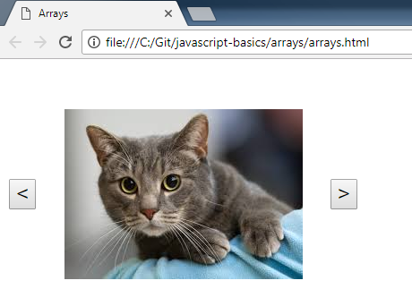
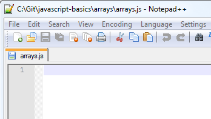
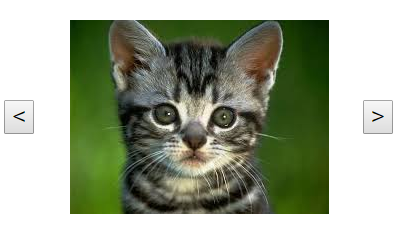

JavaScript Basics - Arrays
===========================

## Introduction

Arrays hold multiple data items.  They can be thought of as lists (in non-technical terms), queues (first in, first out), or stacks (first in, last out).  Items in an array have an index, which represents its position in the array.  Indices are 0 based, which means they start from 0 and end at 1 less than the length of the array.  As such, it is easy to get the value of any item in an array given its index.  For example, given `var myArray = [1, 2, 3, 4, 5, 6];`, `myArray[3]` would return `4`, as the indices are 0, 1, 2, 3, 4, and 5.

A matrix is a two dimensional array.  It's an array of arrays!  Ex. `[[1, 2], [3, 4], [5, 6]]`.  Here you could access an element with two indices, like `myMatrix[0][1]`, which returns `1`.

In this walkthrough, you will create an image viewer using an array of image names.  The left and right buttons will change the image displayed.

## Project Files

* `arrays.html`

    This file is a basic HTML page with some elements.
	- An `image` element called `catPic` that displays a picture of a cat.
	- A `button` element that will "go left" in the array of images.
	- A `button` element that will "go right" in the array of images.
    - A reference to a .css file in the `<head>` tag.  This was necessary to style the page.
    - A `<script>` tag that loads the `arrays.js` file, which provides instructions to the webpage.

* `arrays.js`

    This is a blank JavaScript file.  This is where you will add code to make the webpage do something.
	
* `arrays.css`

	I try to avoid using CSS files for simple samples when possible, but here it was much cleaner to use one.  The purpose of this file is to fix the position of the elements so that they do not move around when the image changes.  It also increases the size of the buttons so they are easier to click.

## Steps

1. Double-click on the `arrays.html` file.  It will open in your default browser.  You should see the cat picture and the buttons.  In the following steps, you will add code to the JavaScript file so that the buttons change the picture.

    
 
2. Open the `arrays.js` file in your favorite text editor.

    
 
3. First, let's define the images that we want to display.  We'll use an array so that we have an ordered list.  We'll store the names of the images in the array.  There is a somewhat simpler way to do this because of the naming convention of the images, but I'm choosing another way for flexibility and because it will let us practice with arrays.

	```js
	var catPicList = ["Cat1.jpg", "Cat2.jpg", "Cat3.jpg", "Cat4.jpg", "Cat5.jpg", "Cat6.jpg", "Cat7.jpg", "Cat8.jpg"];
	```
	
	This assumes that you have these images in the same folder as your HTML and JS files. I have included them for ease of use, but feel free to modify them locally.  If you change the name of an image or add a new one, make the same change or addition to this array.

4. We also need to create a variable to track which image is being shown.

    ```js
	var catPicIndex = 0;
	```
	
	`0` means that we'll start at the first cat picture.  Remember that arrays in JavaScript use a 0-based index, meaning they go from 0 to 1 less than the length of the array.

5. Create a variable for the image element, so we can change it later.
	
	```js
	var catPic = document.getElementById("catPic");
	```

6. Now let's define those button click handlers so that they do something!

	```js
	function goLeft() {
	}
	
	function goRight() {
	}
	```
	
7. The `goLeft()` function should change the image to the one before it in the array.  We need to account for the "edge case" when we're on index 0 and we try to go left.  We should wrap around to the end of the array.  That means, if we're on Cat1.jpg, it will display Cat8.jpg.

	```js
	if (catPicIndex !== 0) {
		catPicIndex--;
	}
	else {
		catPicIndex = catPicList.length - 1;
	}
	catPic.src = "images/" + catPicList[catPicIndex];
	```
	
	If we're not at the edge case, subtract 1 from the index to get the picture "to the left".  If we are on the edge case, wrap to the end of the array.  Then set the `src` attribute of the `` element to the new image name, prefixed with the folder name.

8. The `goRight()` function should change the image to the one after it in the array.  We again need to account for the "edge case" when we're on the last index and we try to go right.  It should wrap around to the beginning of the array.  That means, if we're on Cat8.jpg, it will display Cat1.jpg.

	```js
	catPicIndex = (catPicIndex + 1) % 8;
	catPic.src = "images/" + catPicList[catPicIndex];
	```
	
	We can use modulo (`%`) here to account for the edge case.

9. Save and run the project.  Click on the < and > buttons to browse cat pictures ^-^.
	
	

 
## Notes

Arrays will throw an error if you try to access a value at an index that doesn't exist.  Be careful!  That is why you have to check for the edge cases.  This is a common error when learning arrays, so don't get frustrated.  Also, remember that indexing starts from 0, so if you have 10 items in your array, index 10 doesn't exist – it's from 0 to 9!

In JavaScript you can add, remove, and change values in an array.

* [`push`](https://developer.mozilla.org/en-US/docs/Web/JavaScript/Reference/Global_Objects/Array/push)
* [`pop`](https://developer.mozilla.org/en-US/docs/Web/JavaScript/Reference/Global_Objects/Array/pop)
* [`splice`](https://developer.mozilla.org/en-US/docs/Web/JavaScript/Reference/Global_Objects/Array/splice)
* Set - `myArray[0] = "new value";`
* Get - `var firstValue = myArray[0];`