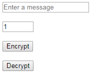
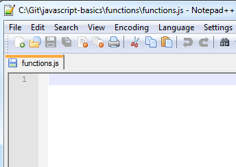
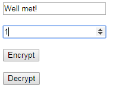
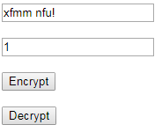

JavaScript Basics - Functions
=============================

## Introduction

A function is a group of instructions.  It's a way to group parts of code that perform an action.  You can also perform the action multiple times or in different parts of the program without rewriting the same code.  This way, you break the problem down into smaller steps.  Instead of worrying how to solve the entire problem at once, you can solve smaller parts of the problem and then combine those solutions.

While it is possible to write an entire program without functions, this becomes very difficult to follow, debug, and even implement as the program gets more complex.  It's a best practice to group code into functions for readability and reusability.  This is covered after the walkthrough.

Functions can have "parameters", which are ways of customizing the code you wrote.  One time, you might want to add 4 to a number.  The next time, you might want to add 5.  Using a parameter, you can specify this increment but still use the same code.

The steps below will create a website that takes a message and encrypts it using the [Caesar Cipher](https://en.wikipedia.org/wiki/Caesar_cipher).  It also decrypts it using the same function.

## Project Files

* `functions.html`

    This file is a basic HTML page with some elements.
	- An `input` element called `inputMessage` that allows you to enter a message to encrypt.  It will also display the message after encrypting and decrypting it.
	- An `input` element called `step` that allows you to set a shift amount (changes the encryption and decryption).  It has a minimum value of 0, a maximum value of 25, and a default value of 1.
	- A `button` element that will encrypt the message.
	- A `button` element that will decrypt the message.
	- `<br/>` tags after most of the elements in the `<body>`.  These are line breaks.  This is simply done to provide spacing between the fields and to display them vertically.  Normally this would be done through CSS, but I wanted to avoid having CSS files when possible, to reduce complexity.
	- A `<script>` tag that loads the `functions.js` file, which provides instructions to the webpage.

* `functions.js`

    This is a blank JavaScript file.  This is where you will add code to make the webpage do something.


## Steps

1. Double-click on the `functions.html` file.  It will open in your default browser.  You should see the two input fields and the two buttons.  In the following steps, you will add code to the JavaScript file so that the decryption and encryption work.

    
 
2. Open the `functions.js` file in your favorite text editor.

    
 
3. First, we will store the `inputMessage` and `step` elements so we can use them later.

	```js
	var message = document.getElementById("inputMessage");
	var step = document.getElementById("step");
	```

	For a reminder of how variables work, reference the [variables](variables.md) walkthrough.

4. There are event handlers defined on both buttons in the HTML file.  We will write the code to make the buttons encrypt and decrypt the message.
	
	Add the two function declarations to the JavaScript file.
	
	```js
	function encrypt() {
	// Add your code here
	}
	
	function decrypt() {
	// Add your code here
	}
	```
 
5. The goal is to encrypt the entered message by the given shift amount.  Let's break the problem down into easier steps.  Our goal is to be able to reuse the same code for both encryption and decryption. We can use a third function to achieve this.  We can customize this function using "parameters".  We'll need parameters to allow the same function to both encrypt and decrypt any entered message.

	a. Let's leave the event handlers alone for now.

	b. Create a function for handling the string transformation.  The basic idea is to convert a string to a character array, shift each character, and output the answer as a string.

	To do this, we should accept 2 parameters.  We'll call them `text` and `amount`.  `text` is the string to shift, and `amount` is the amount by which to shift each character.
	
	```js
	function transform(text, amount)
	{
	}
	```
	
	c. In order to be able to shift the letters, we’ll need to know the numeric values associated with them.
	
	We can use an array of letters and have the index match the numeric value of the letter (with `a` being `0`, `b` being `1`, etc.).  Let's create this data as a variable at the top of the page where the other variables are declared.
	
	```js
	var letters = ['a', 'b', 'c', 'd', 'e', 'f', 'g', 'h', 'i', 'j', 'k', 'l', 'm', 'n', 'o', 'p', 'q', 'r', 's', 't', 'u', 'v', 'w', 'x', 'y', 'z'];
	```
 
	This is an array.  An array is a list of items.  Note how the index of the array will correspond to the number of the letter, with `a` starting at `0` and `z` being `25`.
	
	d. Next, back in the `transform` function, let's convert the message in the function parameter into a character array, so that we can do operations on each character individually.
	
	```js
    var newMessage = text.toLowerCase().split('');
	```
 
	This first converts the message to lower case, so that capital letters are included in the conversion.  Then it uses a built-in JavaScript function called `split` to separate each letter of a string into an entry in an array.  `split` takes a parameter that specifies how to split the string.  Passing in an empty string (either `""` or `''`) will split it at each letter.  Alternatively, you could specify something like `','` to split at commas, but that isn't helpful in this scenario.
	
	e. Get the length of the message so we know how many times we need to encrypt a letter.
	
	```js
	var length = text.length;
	```
 
	f. Now that we have the length of the string, we can use a for loop to cycle through the letters in the character array, and shift each one. 

	```js
	for (var i = 0; i < length; i++)
    {
        var letter = newMessage[i];
        var index = letters.indexOf(letter);
        if (index >= 0)
        {
            newMessage[i] = letters[(index + amount) % 26];
        }
    }
	```
 
	The basic for loop goes from 0 to 1 less than the length.
	
	Next, we get the letter from the string at that index, starting at 0.  Then we figure out where it is in the letters array – meaning the numeric value of the letter, from 0 to 25.  If it exists in the array, meaning the returned value is greater than or equal to 0, then shift it based on the `amount` parameter, which is the number of letters to shift it.  It ignores any characters that are not in the "letters" array, like punctuation and spaces, because `indexOf` will return -1.
	
	The shift adds the `amount` value to the index of the letter, then takes the remainder after dividing by 26, and updates the letter to the shifted one.  We take the remainder after dividing by 26 so that the letters loop around after passing 'z'.  For example, if we have the letter 'y' and we shift it by 2, then it would be `24 + 2 = 26`, which is outside of the array bounds!  Remember, the array indices go from 0 to 25!  The modulo (`%`) operator provides the remainder, which in this case would be 0, resulting in an 'a'.
	
	g. Finally, we need to return the message as a string.
	
	```js
	return newMessage.join('');
	```
 
	Here we `join` the characters, which is the opposite of the `split` we did earlier.  It puts an array of characters back into a string.
	
	The full `transform` function code looks like this.
	
	```js
	function transform(text, amount)
	{
		var newMessage = text.toLowerCase().split('');
		var length = text.length;
	
		for (var i = 0; i < length; i++)
		{
			var letter = newMessage[i];
			var index = letters.indexOf(letter);
			if (index >= 0)
			{
				newMessage[i] = letters[(index + amount) % 26];
			}
		}
	
		return newMessage.join('');
	}
	```
	
7. Now let's get back to the two button click events.  We have to make the buttons do this transformation. Remember, we already did the hard work in creating the `transform` function.  Now let's call it with the correct parameters!

	```js
	function encrypt() {
		var amount = validateAmount(parseInt(step.value, 10));
		message.value = transform(message.value, amount);
	}
	
	function decrypt() {
		var amount = validateAmount(parseInt(step.value, 10));
		message.value = transform(message.value, (26 - amount) % 26);
	}
	```
 
	To encrypt the message, we simply take the entered message and transform it by a valid shift amount.

	To decrypt the message, we send in the same string, but go backwards with the shift.
	
	I added a function `validateAmount` that does some error checking, as it is possible to input an invalid amount.  The second `input` element has a `min` and `max` value defined, along with a default `value`, but this still does not prevent someone from entering a negative number, a value over 25, or something that is not a number.  To handle these cases, we can check for them and change the value to something valid.  First we use modulo to handle values over 25.  Next we check if the number is actually a number.  If it's not, we'll just use `1`.  Then we check if the value is negative.  If it is, we'll make it positive using the built-in "absolute value" (`Math.abs`) function.  Finally, we return the valid amount.
	
	```js
	function validateAmount(amount) {
		var validStep = amount % 26;
		if (isNaN(validStep)) validStep = 1;
		else if (validStep < 0) validStep = Math.abs(validStep);
		return validStep;
	}
	```
	
8. Save and run the project.  Enter a string and a step, and then encrypt and decrypt it!

	Original:
	
	
	
	Encrypted:
	
	
	
	Decrypted:
	
	
 
## Why Use Functions?

In the walkthrough, the `transform` function could have been copied and pasted into two functions, one for encoding, and one for decoding. This would have duplicated code.  Imagine if you had to make a change to the logic.  Then you'd have to remember to make it in 2 places, or you'd have a bug.  It's easier to just have it in 1 function and call the function twice.  You could say that this is a "best practice" but it just makes sense!  The same could be applied to a scenario where you have 9 buttons that all do the same thing – why write the code 9 times when you can write it once?

It breaks up the code into understandable parts.  I can easily see that the `encrypt` and `decrypt` methods are doing almost the same thing – using different parameters for the same function.  I only have to write the function that does the work once.  This is especially important for other people looking at your code, or if you inherit someone else's code!

It allows for easy code re-use.  No more copying and pasting the same code into multiple parts of the program.  Not only does this make the code easier to read and shorter, but it also makes it more stable because you have less to maintain.

It helps with debugging.  If something is wrong with how the string is getting encrypted or decrypted, the problem can be narrowed down to either the calls to the `transform` function, or the `transform` function itself.

It allows the same code to be used with different values.  The parameters in the walkthrough allow us to use the same `transform` function to do both encoding and decoding, by changing the `amount` parameter.