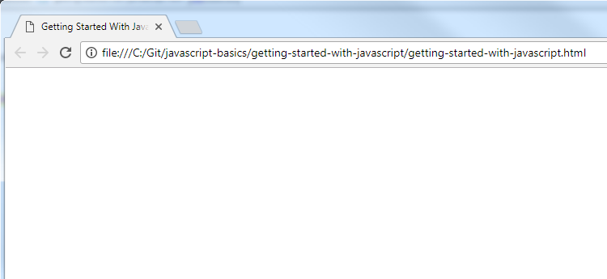
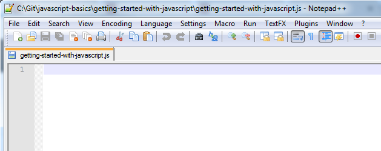
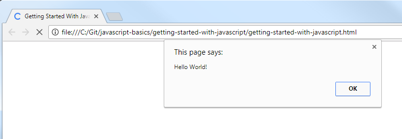
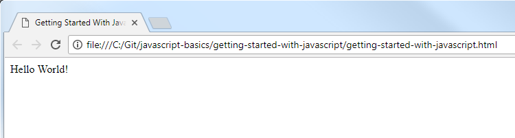

Getting Started with JavaScript
================================

## Introduction

A basic web application consists of 3 types of files.

* HTML - Defines the elements on a webpage.
* JavaScript - Provides logic and interaction with the elements on the webpage.
* CSS - Provides styling for the webpage.

In this series of walkthroughs, the HTML file will be provided and explained in the instructions.  This is done so that you can focus on JavaScript.  There is a CSS file for only one of the walkthroughs.

The steps below will display a "Hello World!" message after a webpage loads.  This is a traditional first step in programming.

## Project Files

* `getting-started-with-javascript.html`

    This file is simply a blank HTML page.  This will display as a blank page in a web browser.  The title is set, which is what you will see in the tab of your browser.  Otherwise, it is just the basic structure of an HTML file with no elements in it.

    Using a `<script>` tag, it loads the `getting-started-with-javascript.js` file, which provides instructions to the webpage.

* `getting-started-with-javascript.js`

    This is a blank JavaScript file.  This is where the reader will add code to make the webpage do something.

## Steps

1. Double-click on the `getting-started-with-javascript.html` file.  It will open in your default browser.  You should see an empty page with just a title in the tab.  This is because the only thing in that file, aside from the basic HTML required to make a webpage, is a link to an empty JavaScript file.  In the following steps, you will add code to the JavaScript file so that the webpage will display something.

    
 
2. Open the `getting-started-with-javascript.js` file in your favorite text editor.

    
 
3. Add the following code to the JavaScript file.  It will display an alert in the browser saying "Hello World!".

	```js
	alert("Hello World!");
	```
 
4. Save the JavaScript file.  Double-click on the .html file again to view it in a browser.

    

    Here a browser alert is shown with the text you provided.

5. Using alerts is very easy, but not a friendly way to interact with a webpage.  It blocks the webpage from loading or doing anything else until the alert is dismissed.  Another way to do this is to add or update an element in the HTML page, although this is more advanced than a simple alert.

    Remove the `alert("Hello World!");` line from the JavaScript file.  Then add the following code.

    ```js
	var message = document.createElement("div");
	message.id = "message";
	message.innerHTML = "Hello World!";
	document.body.appendChild(message);
	```

    This code creates an HTML `div` element, sets the `id`, sets some text, and adds it to the webpage.  Setting the `id` has no visible effect, but it would be useful for future interactions with that element.  The result is that the message is displayed in that `div` instead of in an alert.  Variables are covered in the next walkthrough.
    
    
	
That’s it!  You've written your first JavaScript program!