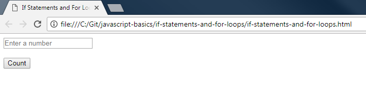
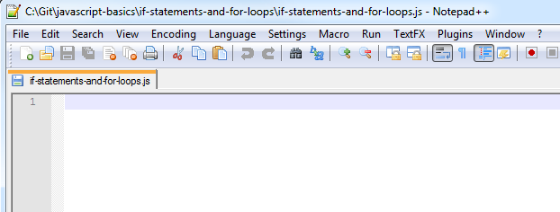
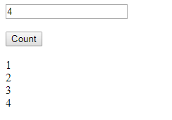
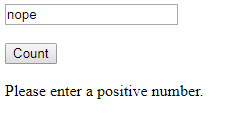

JavaScript Basics - If Statements and For Loops
===============================================

## Introduction

An "if" statement does an action if a certain condition is met.  This allows for code to execute only in certain situations.  A "for" loop does an action a specified number of times.  This allows you to do the same thing, or similar things, over and over again without writing the same code multiple times.

A "while" loop is similar to a "for" loop.  It runs the same code as long as a certain condition is met.  It's like an "if" statement, but multiple times.  For example, you could prompt the user to enter valid input until they do.

There is also a "switch" statement, which is like multiple "if" statements based on different possible values of the same variable.

The "if", "for", "while" and "switch" concepts can all be grouped as program "logic".  They control execution of code based on conditions.

The steps below will create a website that asks for a number, and prints out all of the numbers from 1 to that number.  It checks to make sure that the number is at least 1, otherwise it doesn’t make sense.  The "while" loop and "switch" statement are explained as alternatives to the "for" loop and "if" statement at the bottom of this file.

## Project Files

* `if-statements-and-for-loops.html`

    This file is a basic HTML page with 3 elements.
	- An `input` element called `maxNumber` that allows you to enter the maximum number.
	- A `button` element that will display the numbers when clicked.
	- A `div` element called `result` that will display the list of numbers, or a corrective message.
	- `<br/>` tags after most of the elements in the `<body>`.  These are line breaks.  This is simply done to provide spacing between the fields and to display them vertically.  Normally this would be done through CSS, but I wanted to avoid having CSS files when possible, to reduce complexity.
	- A `<script>` tag that loads the `if-statements-and-for-loops.js` file, which provides instructions to the webpage.

* `if-statements-and-for-loops.js`

    This is a blank JavaScript file.  This is where you will add code to make the webpage do something.

## Steps

1. Double-click on the `if-statements-and-for-loops.html` file.  It will open in your default browser.  You should see an input field and a button.  In the following steps, you will add code to the JavaScript file so that the button will display either a list of numbers or a corrective message.

    
 
2. Open the `if-statements-and-for-loops.js` file in your favorite text editor.

    
 
3. There is an "event handler" defined on the button in the HTML file.  You can see it has `onClick="countToN()"`.
	
	We will define a `countToN()` function.  Add the function declaration to the JavaScript file.
	
	```js
	function countToN() {
	// Add your code here
	}
	```
	
4. Get the value from the text box using [variables](variables.md).  Remove the `// Add your code here` comment and add the following code in its place.

	```js
	var input = document.getElementById("maxNumber");
	var number = parseInt(input.value, 10);
	var result = document.getElementById("result");
	```
	
	Here we get the `input` element from the HTML page, and store the number that the user entered in a `number` variable.  For a reminder of how this works, reference the [variables](variables.md) walkthrough.  We also get the `result` element in preparation for using it to display the list of numbers or a message.
	
5. Do some basic error checking to ensure a positive number was entered.  We covered this briefly in the [variables](variables.md) walkthrough, but here we will cover the "if statement" in more detail.

	```js
	if (isNaN(number) || number < 1) {
		result.innerHTML = "Please enter a positive number.";
	}
	```
	
	Here we are simply checking if either the number is not actually a number, or if the number entered was less than 1.  In either case, we want to display a message to correct the input.

	This code uses an "if statement" to execute code only in certain conditions.  The basic structure is:
	
	```
	if (some-condition) {
		do-something-about-it();
	}
	else if (some-other-condition) {
		do-something-different();
	}
	else {
		do-another-thing();
	}
	```
	
	The conditions must resolve to a boolean (true or false) value.  As such, you will often do a comparison.
	* Equals - `===`
	* Greater Than - `>`
	* Greater Than or Equal To - `>=`
	* Less Than - `<`
	* Less Than or Equal To - `<=`

	You can also use logical operators to combine or negate statements.
	* AND - `&&`
	* OR - `||`
	* NOT - `!`

6. If the number entered was valid, display a list of integers from 1 to that number.  We will use a `for` loop.  It repeats the same code multiple times.  In this case, we want to count up to the number that was entered, starting from 1.  We will execute the same line of code `n` times, where `n` is the parsed value of the number entered.
	
	```js
	else {
		result.innerHTML = "";
		for (var i = 1; i <= number; i++) {
			result.innerHTML += i + "<br/>";
		}
	}
	```
 
	We're putting this in an `else` block, which goes along with the `if` from before.  It means "Otherwise (the input was valid), do this".
	
	The `for` loop basic structure is:
	
	```
	for (var i = initial-value; i [comparison] end-value; [change i]) {
		do-something();
	}
	```
	
	This declares a variable used as the "counter".  It's typical to name it "i" for "index", but any valid variable name can be used.  The `initial-value` is where you want to start.  Here we start at 1.  The `end-value` is at what point you want to stop.  Here we use `<=` as the comparison because we want to include the last number.  [change i] is where you adjust the value of `i` to make sure that the loop stops eventually.  It will often be `i++`.  `i++` means "increment i" (count up).  The `for` loop will stop when the condition `i [comparison] end-value` is false.  For example, if you want to count from 1 to 4, `i` will go from 1 -> 2 -> 3 -> 4 -> 5.  When it hits 5, `i` is NOT less than or equal to 4, so we stop.
	
	Inside the `for` loop, we simply update the result element to append (`+=`) the number we're on, followed by a line break for formatting.
	
	You'll notice that the first line in the `else` statement resets the output.  This will clear any error messages or any previous outputs.
 
7. Save the JavaScript file.  Double-click on the .html file again to view it in a browser.  Enter a positive number and see what happens when you click on the button.

	
 
8. Try entering some text instead of a number, or a number less than 1.  You'll see a message asking you to enter a number.  Error checking is good. :)

    

The full code should look like this.

```js
function countToN() {
	var input = document.getElementById("maxNumber");
	var number = parseInt(input.value, 10);
	var result = document.getElementById("result");
	
	if (isNaN(number) || number < 1) {
		result.innerHTML = "Please enter a positive number.";
	}
	else {
		result.innerHTML = "";
		for (var i = 1; i <= number; i++) {
			result.innerHTML += i + "<br/>";
		}
	}
}
```

Now you've gotten some practice with if statements and for loops, and are ready to learn more!
 
## Alternative Code Flow Logic

### While Loop

As mentioned in the introduction, a "while" loop can be used to accomplish the same thing as a "for" loop.

```
while ([variable] [comparison operator] [value])
{
// add code
}
```

The code will execute as long as the statement inside the parentheses is true.

For example:

```js
var result = document.getElementById("result");
var remaining = 5;
while (remaining > 0)
{
	result.innerHTML += remaining + "<br/>";
	remaining--; // -- means "subtract 1", similar to how ++ means "add 1"
}
```

The major differences are that you have to declare and initialize the variable outside of the "while" loop, and that you have to change the variable's value somehow inside of the "while" loop.  These are two things that the "for" loop does on its own.

### Switch Statement

A "switch" statement can be used to cover multiple cases for the same variable.

```
switch (condition)
{
  case [value]:
    code
    break;
  case [value]:
    code
    break;
  ...
  default:
    code
    break;
}
```

Only when the value matches the condition will the code in that case be executed.

For example, let's say you have a value x that the user inputs.

```js
var result = document.getElementById("result");
switch (x)
{
  case 1:
    result.innerHTML = "You entered 1!";
    break;
  case 0:
    result.innerHTML = "You entered 0!";
    break;
  default:
    result.innerHTML = "Seriously, learn binary.";
    break;
}
```

Switch statements are most useful when you have a small range of values and you want to do something different for each one.  They can also be easy to read and debug.  Otherwise, "if/else if/else" statements should be used.