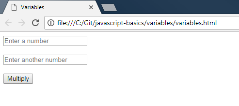
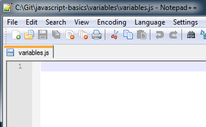
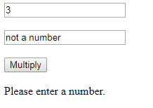

JavaScript Basics - Variables
==============================

## Introduction

A variable is a way to store a piece of data.  As the name suggests, that data may change.  JavaScript is a dynamically typed language.  This means you don't have to declare the type (ex. string, number, array) of the variable, and it can change types when being set.

The steps below will allow the user to enter two numbers, multiply them, and show the result on the webpage.

## Project Files

* `variables.html`

    This file is a basic HTML page with the following elements.
	- An `input` element called `firstNumber` that allows you to enter the first number.
	- An `input` element called `secondNumber` that allows you to enter the second number.
	- A `button` element that will multiply the two numbers when clicked.
	- A `div` element called `result` that will display the result, or a corrective message.  
	- `<br/>` tags after most of the elements in the `<body>`.  These are line breaks.  This is simply done to provide spacing between the fields and to display them vertically.  Normally this would be done through CSS, but I wanted to avoid having CSS files when possible, to reduce complexity.
	- A `<script>` tag that loads the `variables.js` file, which provides instructions to the webpage.

* `variables.js`

    This is a blank JavaScript file.  This is where you will add code to make the webpage do something.

## Steps

1. Double-click on the `variables.html` file.  It will open in your default browser.  You should see the two input fields and the button.  In the following steps, you will add code to the JavaScript file so that the multiply button will either multiply the two numbers, or display a corrective message.

    
 
2. Open the `variables.js` file in your favorite text editor.

    
 
3. There is an "event" defined on the button in the HTML file.  You can see it has `onClick="multiply()"`.  We will define that "event handler".  This means it will do something when the button is clicked. The click is an "event", and our code will "handle" it, meaning that it will respond to the click and do something.
	
	We will define a `multiply()` function.  A function is a reusable piece of code.  It groups some instructions together such that you can do all of them with just one "function call", meaning that you just write `multiply()` and it does everything defined in the `multiply()` function.  Add the function declaration to the JavaScript file.
	
	```js
	function multiply() {
	// Add your code here
	}
	```
	
	The keyword `function` defines this as a function.  The name `multiply` comes next, and the `()` shows that it will be executed without requiring any "parameters".  A later walkthrough will cover functions in more detail.  The `{` and `}` delimit the function code.  And `//` indicates a comment, so we can write whatever instructions would be useful to the reader, and the browser will ignore them.  They won't be interpreted as code.
	
4. Now we'll set some variables!  The first set of variables will hold some HTML elements so we can get or set their values.  The second set will hold the numbers to multiply.

	Remove the comment `// Add your code here` and add the following code in its place.
	
	```js
	var result = document.getElementById("result");
	var input1 = document.getElementById("firstNumber");
	var input2 = document.getElementById("secondNumber");
	
	var num1 = parseInt(input1.value, 10);
	var num2 = parseInt(input2.value, 10);
	```

	`var` means you are declaring a variable.  The next word is the name of the variable.  `result`, `input1`, and `input2` all represent some HTML element from the webpage.  `document.getElementById` means "get the HTML element with a specific ID from the webpage".  In the .html file, these elements have ID attributes so that we can easily interact with them in JavaScript.  The first three lines here simply "get" parts of the page so we can use them.
	
	`num1` and `num2` are the variables that represent the numbers that were entered.  `parseInt` takes a text value and tries to convert it to a number.  It takes two parameters - the value, and the base.  We'll cover parameters more in a future walkthrough.  We're going to keep this simple and only do integer multiplication.  If a non-integer value is entered, it will be floored, meaning that the fractional part will be removed.  For example, `10.5` would become `10`.  `input1.value` and `input2.value` are the numbers that were entered into the webpage.  Remember that we defined `input1` and `input2` as the elements on the HTML page that allow a number to be entered.  `.value` gets what was entered.  The `10` parameter means that we expect a number in base 10 (decimal).  There are other numbering systems, like binary (only 0s and 1s), octal (0 - 7) and hexadecimal (0 - f).  We specify decimal (0 - 9).

4. The final step would be to multiply the numbers.  But wait!  Something that isn't a number could be entered, and that would break our multiplication.  So we'll include some simple error checking and then we'll multiply the numbers.  For more information about why we do this, please see the note at the bottom of the walkthrough.

	Add the following code after the variables in the JavaScript file.
	
	```js
	if (isNaN(num1) || isNaN(num2)) {
		result.innerHTML = "Please enter a number.";
	}
	else {
		result.innerHTML = num1 * num2;
	}
	```
	
	We will cover `if/else` statements in a later walkthrough, but it allows us to do things conditionally.  We check if either `num1` or (`||` means "or") `num2` is `NaN`, which means "not a number".  If that's the case, we provide a helpful message instead of doing the multiplication.  Otherwise, we multiply the two numbers and display the result.

5. Save the JavaScript file.  Double-click on the .html file again to view it in a browser.  Enter two numbers and see what happens when you click on the button.

	
 
6. Try entering some text instead of a number.  You'll see a message asking you to enter a number.  Error checking is good. :)

    

The full code should look like this.

```js
function multiply() {
	var result = document.getElementById("result");
	var input1 = document.getElementById("firstNumber");
	var input2 = document.getElementById("secondNumber");
	
	var num1 = parseInt(input1.value, 10);
	var num2 = parseInt(input2.value, 10);
	
	if (isNaN(num1) || isNaN(num2)) {
		result.innerHTML = "Please enter a number.";
	}
	else {
		result.innerHTML = num1 * num2;
	}
}
```

Now you've gotten some practice with variables and are ready to learn more!
	
## Detailed Explanations

### About Types of Variables

JavaScript is dynamically typed, so you do not have to declare the type of the variable, as you do in other languages such as C#.  JavaScript will figure out that `3` is a number, and that `"3"` is a string (text).  It knows that `[3, 3]` is an array, so you don't have to specify that when creating a variable.  This is convenient but it also means that some logic errors will be discovered only at runtime (when you test your program), because there is no "compilation" step, which would catch type-based invalid operations and fail before launching the webpage.  If something doesn't work right, press `F12` with the webpage open in your browser.  It will bring up a Console (you may have to click on that tab) and you will see any errors that occurred.

### About Accessing Elements On The Webpage

Getting an element from an HTML page is a common task in JavaScript code.

```
var name-of-variable = document.getElementById("id-of-element");
```

As discussed in the steps, `var` means "variable", and is followed by the name of the variable.  You can use almost any name except for some reserved keywords.  It's unlikely you'll run into those if you choose descriptive names for your variables.

`document.getElementById("id-of-element")` is a built-in DOM (Document Object Model) interaction method.  It goes to the HTML file (`document`), finds an element with the `id` attribute set to the "id-of-element" you provided, and returns the HTML for that element.  So getting the `result` element returns `<div id="result"></div>`.

### About Assigning Values

One confusing concept is that the `=` sign does not actually mean "equals".  It means "is assigned the value" of whatever follows it.

```js
var simpleMult = 3 * 3;
```

In that example, the variable `simpleMult` is given the value of the result of the multiplication `3 * 3`.

The way to check for equality is to use `==` or `===`.  For example `3 === 2` will return `false` and `3 === 3` will return `true`.  `==` does not check types while `===` does.  This difference is a more advanced topic and is out of the scope of these walkthroughs.  In general, you want to use `===`, but if you use `==` instead, it will still work almost all the time.

### A Note About `<input type="number">`

HTML5 allows specifying a number input.  However, not all browsers support HTML5, and as such, this input will be treated as a text box.  The latest versions of Firefox and Chrome both support HTML5 and should display spin buttons and allow only numeric input.  However, IE11 on some operating systems or earlier versions of Internet Explorer will not recognize this.  That is the reason why the check for valid numeric input is still there.