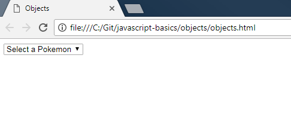
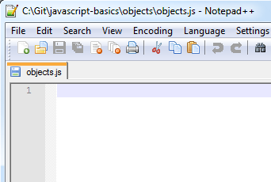
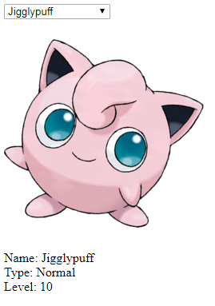

JavaScript Basics - Objects
===========================

## Introduction

Objects model data.  JavaScript objects are very flexible, so they can be customized to your scenario.  You can define properties on the object to store information related to that object.

A generic way to demonstrate objects is to create something like a "person" object with first name, last name, age, and other properties.  That's boring.  Let's use Pokémon and include name, type, level, and image properties.

The steps below will create a website that displays an image of a Pokémon and its name, type, and level.

## Project Files

* `objects.html`

    This file is a basic HTML page with some elements.
	- A `select` element which provides a list of Pokémon from which to choose.  This is like a combo box.  It has an event handler called `DisplayInfo()`.
	- An `image` element called `picture` that displays a picture of the selected Pokémon.
	- A `div` element that will display information about that Pokémon.
	- A `<script>` tag that loads the `objects.js` file, which provides instructions to the webpage.

* `objects.js`

    This is a blank JavaScript file.  This is where you will add code to make the webpage do something.

## Steps

1. Double-click on the `objects.html` file.  It will open in your default browser.  You should see the combo box.  In the following steps, you will add code to the JavaScript file so that an image and description appear upon selecting a Pokémon.

    
 
2. Open the `objects.js` file in your favorite text editor.

    
 
3. First, let's get the combo, image, and description HTML elements so that we can use them later.

	```js
	var list = document.getElementById("pokemonList");
	var image = document.getElementById("picture");
	var description = document.getElementById("description");
	```

4. We need to define the data for these Pokémon so that we can display it if selected.  We will use objects to achieve this.

	```js
	var bulbasaur = {
		name: "Bulbasaur",
		type: "Grass",
		level: "5",
		picture: "images/Bulbasaur.png"
	};

	var charmander = {
		name: "Charmander",
		type: "Fire",
		level: "5",
		picture: "images/Charmander.png"
	};

	var squirtle = {
		name: "Squirtle",
		type: "Water",
		level: "5",
		picture: "images/Squirtle.png"
	};

	var jigglypuff = {
		name: "Jigglypuff",
		type: "Normal",
		level: "10",
		picture: "images/Jigglypuff.png"
	};
	```
	
	Here we define 4 Pokémon each with 4 properties: `name`, `type`, `level`, and `picture`.  We can now use these property names to get the values.  For example, `bulbasaur.type` would return "Grass".
	
	Using `{}` with a variable indicates an object.  The object properties are set as shown.  `property-name: "Property Value"` is the pair of the name and value.  This must be followed by a `,` unless it is the last property on an object.
	
	It is a best practice to keep the first letter of variable names lowercase.
	
5. Let's create an array of these objects so we can easily access them later.

	```js
	var array = [bulbasaur, charmander, squirtle, jigglypuff];
	```

6. We will display the information when the Pokémon is selected from the combo box.  To do this, we write the `displayInfo()` function.

	```js
	function displayInfo() {
		var index = list.selectedIndex - 1;
		var selectedPokemon = array[index];
		image.src = selectedPokemon.picture;
		description.innerHTML = describe(selectedPokemon);
	}
	```
	
	We have to subtract 1 from the index of the combo box because the first item displays the instructions to select a Pokémon.  This will be index 0, where we want "Bulbasaur" to be index 0.
	
	We save the selection from the combo box in a variable called `selectedPokemon`.  We get the Pokémon object from the array we defined.
	
	We update the image to the one specified in the object.
	
	We call another function `describe` to fill in the description of that Pokémon.
	
7. Define `describe`.

	```js
	function describe(my) {
		var text = "Name: " + my.name + "<br/>";
		text += "Type: " + my.type + "<br/>";
		text += "Level: " + my.level;
		return text;
	}
	```
	
	This simply builds a string that lists the non-image properties we defined for each Pokémon.  `<br/>` is a line break.
	
8. Save the JavaScript file and double-click on the .html file to display the website.  Select a Pokémon and see what happens!

	
	
Below is the full code for your reference.

```js
var list = document.getElementById("pokemonList");
var image = document.getElementById("picture");
var description = document.getElementById("description");

var bulbasaur = {
	name: "Bulbasaur",
	type: "Grass",
	level: "5",
	picture: "images/Bulbasaur.png"
};

var charmander = {
	name: "Charmander",
	type: "Fire",
	level: "5",
	picture: "images/Charmander.png"
};

var squirtle = {
	name: "Squirtle",
	type: "Water",
	level: "5",
	picture: "images/Squirtle.png"
};

var jigglypuff = {
	name: "Jigglypuff",
	type: "Normal",
	level: "10",
	picture: "images/Jigglypuff.png"
};

var array = [bulbasaur, charmander, squirtle, jigglypuff];

function displayInfo() {
	var index = list.selectedIndex - 1;
	var selectedPokemon = array[index];
	image.src = selectedPokemon.picture;
	description.innerHTML = describe(selectedPokemon);
}

function describe(my) {
	var text = "Name: " + my.name + "<br/>";
	text += "Type: " + my.type + "<br/>";
	text += "Level: " + my.level;
	return text;
}
```