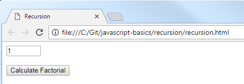
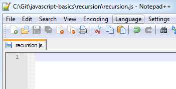
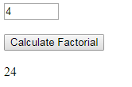

JavaScript Basics - Recursion
=============================

## Introduction

Recursion is an advanced concept, but allows for complex issues to be solved simply with very little code.  There are two parts to any recursive solution – a "base case" and a "recursive step".  The "base case" is one where you have solved the problem completely.  The "recursive step" is where the problem is simplified and retried.  As such, you continually advance toward a solution until the "base case" is hit.

Recursion will be shown by computing the factorial of a number (`x! = x * (x – 1) * (x -2) * (x – 3) … * 1`).  For example, the factorial of 4 is written as `4!` and means `4 * 3 * 2 * 1`.

The steps below will create a website that asks for a number, and then calculates and displays the factorial of that number.

## Project Files

* `recursion.html`

    This file is a basic HTML page with some elements.
	- An `input` element called `number` that allows you to enter a positive number.
	- A `button` element that will calculate and display the factorial of that number.
	- A `div` element called `answer` where the factorial will be displayed.
	- `<br/>` tags after most of the elements in the `<body>`.  These are line breaks.  This is simply done to provide spacing between the fields and to display them vertically.  Normally this would be done through CSS, but I wanted to avoid having CSS files when possible, to reduce complexity.
	- A `<script>` tag that loads the `recursion.js` file, which provides instructions to the webpage.

* `recursion.js`

    This is a blank JavaScript file.  This is where you will add code to make the webpage do something.

## Steps

1. Double-click on the `recursion.html` file.  It will open in your default browser.  You should see the the input field and the button.  In the following steps, you will add code to the JavaScript file so that the button calculates the factorial of the entered number.

    
 
2. Open the `recursion.js` file in your favorite text editor.

    
 
3. First, we will store the `number` and `answer` elements so we can use them later.

	```js
	var number = document.getElementById("number");
	var answer = document.getElementById("answer");
	```

	For a reminder of how variables work, reference the [variables](variables.md) walkthrough.

4. There is an event handler defined on the button in the HTML file.  We will write the code to make the button calculate the factorial of the number.
	
	Add a function declaration to the JavaScript file.
	
	```js
	function calculate() {
	// Add your code here
	}
	```
	
	This will not actually compute the factorial directly, but will call a helper function to do the work.

5. Let's start by getting the number from the input, and making sure it's a valid number.

	```js
	var n = parseInt(number.value);
	if (n < 1 || isNaN(n)) n = 1;
	else if (n > 100) n = 100;
	```
	
	Here we store the number in a variable called `n`.  We also check if `n` is less than 1 or if it's not a number.  If either of those cases is true, then we'll set `n` to `1`.  If `n` is greater than 100, let's keep things simple and set it to a maximum value of `100`.
	
6. Next, let's call the helper function and use the answer from that to update the webpage with the answer.

	```js
	answer.innerHTML = factorial(n);
	```

7. We need to define the helper function `factorial`.  It takes a parameter `n` that will be decremented until we get to the base case.

	```js
	function factorial(n) {
	// Add your code here
	}
	```

8. Next we'll define the base case.  This means the simplest solution.  Given that a factorial is the product of all numbers from 1 to `n`, it makes sense that the base case is 1.

	```js
	if (n === 1) return 1;
	```
	
	`1!` is 1.
	
7. What do we do if the number is greater than 1?  We have to multiply `n * (n - 1) * (n - 2)... * 1`.  That's a bit complicated if you think about it all at once.

	Instead, let's think about it going up from 1.
	
	```
	1! = 1
	2! = 2 * 1 = 2
	3! = 3 * 2 * 1 = 6
	4! = 4 * 3 * 2 * 1 = 24
	5! = 5 * 4 * 3 * 2 * 1 = 120
	```
	
	As you can see, we're doing a lot of the same work each time.  See the pattern?  Each time we increment `n`, we simply multiply the new `n` by the result of the previous factorial operation!  Thinking about it in a different way, `n! = n * (n - 1)!`.  This is the basis of recursion, where we can define a "recursive step", where we simply specify what to do in general, and we know at some point we will hit the base case.  Here, because we're taking the factorial of `n - 1`, at some point `n` will be `1`, which is our base case.  At that point, it will stop decrementing and calling the function again, and the value will be calculated from all the results.
	
	```js
	else return n * factorial(n - 1);
	```
	
	Here's how it works:
	
	```
	factorial(4)
	4 * factorial(3)
	4 * 3 * factorial(2)
	4 * 3 * 2 * factorial(1)
	4 * 3 * 2 * 1
	24
	```

8. For your reference, here is the full code.

	```js
	var number = document.getElementById("number");
	var answer = document.getElementById("answer");

	function calculate() {
		var n = parseInt(number.value);
		if (n < 1 || isNaN(n)) n = 1;
		else if (n > 100) n = 100;
	
		answer.innerHTML = factorial(n);
	}

	function factorial(n) {
		if (n === 1) return 1;
		else return n * factorial(n - 1);
	}
	```

9. Save and run the project.  Enter a number and click "Calculate Factorial".

	